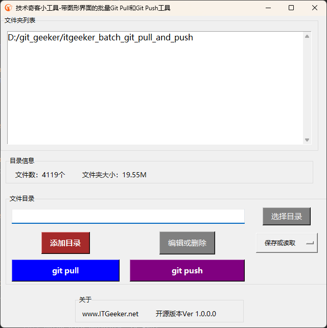

# 开源带图形界面的批量Git Pull和Git Push工具

#### 介绍
技术奇客开源软件系列 - 带图形界面的批量Git Pull和Git Push工具。

    - 自由添加或删除需要git pull或push的目录列表
    - 可对目录列表进行批量的git pull或push
    - 目录列表可以保存，也可以读取。默认当前界面的列表关闭后自动保存

技术奇客是奇客罗方智能科技的关联公司。更多信息可访问 ITGeeker技术奇客官方博客 [www.itgeeker.net](https://www.itgeeker.net) 或者 GeekerCloud奇客罗方智能科技 [https://www.geekercloud.com](https://www.geekercloud.com)

>软件下载

[下载带图形界面的批量Git Pull和Git Push工具](https://www.itgeeker.net/itgeeker-technical-service/itgeeker_batch_git_pull_and_push_tool_with_ui/)

>工具主界面

#### 软件架构
软件采用Python 3.11版本结合Tkinter UI开发，可以运行于Windows 10/11. windows需要安装git bash或其他支持git命令的软件才能使用。python代码也可以直接运行于Linux系统。
git push起初采用的是gitpython包,但碰到pyinstaller打包问题，最后改用了subprocess来执行。

    - Windows系统请下载发行版的exe可执行文件即可。
    - Linux理论上只要是Python 3的环境都可直接运行。

#### 运行及使用说明

> Windows版本

    1.  下载可执行文件
    2.  双击文件并执行
    3.  添加想要处理的目录列表
    4.  开始批量处理git pull或push

> Linux版本

    1.  确定你又安装Python 3版本，最好3.8以上版本
    2.  安装Python依赖："pip install gitpython tkinter"
    3.  下载本项目到本地目录，并运行："python batch_git_pull_and_push_main.py"

处理过程如遇错误，会弹窗提醒。

#### 更新日志

> 2023-07-08 v1.0.0.0
 
    1. 第一版本发布

#### 参与贡献

    1.  Fork 本仓库
    2.  新建 Feat_xxx 分支
    3.  提交代码
    4.  新建 Pull Request

#### 其他

    1.  ITGeeker 官方博客 [www.itgeeker.net](https://www.itgeeker.net)
    2.  Gitee开源项目地址 [https://gitee.com/itgeeker/ itgeeker_batch_git_pull_and_push](https://gitee.com/itgeeker/ itgeeker_batch_git_pull_and_push) 
    3.  Github开源项目地址 [https://github.com/alanljj/ itgeeker_batch_git_pull_and_push](https://github.com/alanljj/ itgeeker_batch_git_pull_and_push) 
    4.  GeekerCloud奇客罗方智能科技 [https://www.geekercloud.com](https://www.geekercloud.com)

#### 技术奇客ITGeeker的其他开源软件

    1. Gitee开源Word字符移除 [https://gitee.com/itgeeker/itgeeker_remove_str_from_word](https://gitee.com/itgeeker/itgeeker_remove_str_from_word) 
    2. Github开源Word字符移除 [https://github.com/alanljj/itgeeker_remove_str_from_word](https://github.com/alanljj/itgeeker_remove_str_from_word)
    3. Gitee开源Word文字替换 [https://gitee.com/itgeeker/itgeeker_word_str_replacement](https://gitee.com/itgeeker/itgeeker_word_str_replacement) 
    4. Github开源Word文字替换 [https://github.com/alanljj/itgeeker_word_str_replacement](https://github.com/alanljj/itgeeker_word_str_replacement)
    5. Gitee开源Word格式转换 [https://gitee.com/itgeeker/itgeeker_convert_doc_to_docx](https://gitee.com/itgeeker/itgeeker_convert_doc_to_docx)
    6. Github开源Word格式转换 [https://github.com/alanljj/itgeeker_convert_doc_to_docx](https://github.com/alanljj/itgeeker_convert_doc_to_docx) 
